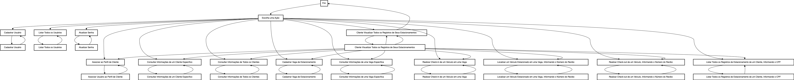

<div align="center">
  <h1>Park API</h1>
  <p>Sistema de gerenciamento de vagas de estacionamento. Possui recursos como autenticação de usuários, cadastrar e gerenciar informações de usuários, com perfis de cliente e administrador. Ele também permite consultas específicas, como listar usuários cadastrados, atualizar senhas, e realizar operações de check-in e check-out de veículos estacionados. Além disso, o sistema gera relatórios de estacionamentos. Desenvolvido com tecnologias como Java e o framework Spring, sendo sistema robusto, permitindo persistência em banco de dados MySQL, com cobertura de testes, autenticação usando o Spring Security e token JWT.</p>
    
</div>

# 📒 Índice
* [Descrição](#descrição)
* [Requisitos Funcionais](#requisitos)
  * [Features](#features)
* [Tecnologias](#tecnologias)
* [Endpoints](#endpoints)
* [Instalação](#instalação)
* [Licença](#licença)

# 📃 <span id="descrição">Descrição</span>
Sistema de gerenciamento de vagas de estacionamento. Possui recursos como autenticação de usuários, cadastrar e gerenciar informações de usuários, com perfis de cliente e administrador. Ele também permite consultas específicas, como listar usuários cadastrados, atualizar senhas, e realizar operações de check-in e check-out de veículos estacionados. Além disso, o sistema gera relatórios de estacionamentos. Desenvolvido com tecnologias como [**Java**](https://www.java.com/) e o framework [**Spring**](https://spring.io/), sendo sistema robusto, permitindo persistência em banco de dados [**MySQL**](https://www.mysql.com/), com cobertura de testes utilizando [**JUnit**](https://junit.org/junit5/), autenticação usando o [**Spring Security**](https://spring.io/projects/spring-security), token [**JWT**](https://jwt.io/), encriptação de senhas utilizando [**BCrypt**](https://en.wikipedia.org/wiki/Bcrypt) e documentação desenvolvida pelo [**Swagger**](https://swagger.io/).

# 📌 <span id="requisitos">Requisitos Funcionais</span>
- [x] Cadastramento de um usuário<br>
- [x] Listar todos os usuário cadastrados<br>
- [x] Atualizar a senha de um usuário especifico<br>
- [x] Associar o usuário ao perfil de cliente<br>
- [x] Consultar as informações de um cliente especifico<br>
- [x] Consultar as informações de todos os cliente<br>
- [x] Cadastrar vaga de estacionamento<br>
- [x] Consultar as informações de uma vaga especifica<br>
- [x] Realizar check-in de um veiculo em uma vaga<br>
- [x] Localizar um veiculo estacionado em uma vaga, informando o numero do recibo<br>
- [x] Realizar o check-out do cliente sobre um veiculo estacionado, informando o numero do recibo<br>
- [x] Listar todos os registros de estacionamento de um cliente, informando o CPF<br>
- [x] Cliente podendo visualizar todos os registros de seus estacionamentos<br>

## Features
- [x] Autenticação de usuário utilizando JWT Token<br>
- [x] Exibição de informações do próprio usuário em sessão ativa<br>
- [x] Adicionando mapeamento de CORS<br>
- [x] Modelo de domínio complexo<br>
- [x] Projeção com SQL nativo<br>
- [x] Geração de relatórios utilizando Jasper Reports<br>
- [x] Cobertura de testes<br>

# 💻 <span id="tecnologias">Tecnologias</span>
- **Java**
- **Spring**
- **Spring Web**
- **Spring Reactive Web**
- **Spring Boot DevTools**
- **Spring Data JPA**
- **Spring Bean Validation**
- **JUnit**
- **JWT**
- **BCrypt**
- **Swagger**
- **MySQL**
- **H2 Database**
- **Jasper Reports**

# 📍 <span id="endpoints">Endpoints</span>
| Método | Endpoint               | Resumo                                          | Autenticação               | Role
|--------|----------------------|-----------------------------------------------------|--------------------------|----------------------
<kbd>POST</kbd> | <kbd>/auth</kbd> | Responsável por autenticar o usuário, gerando o Bearer Token *JWT* | Sim | *
<kbd>POST</kbd> | <kbd>/users</kbd> | Responsável por cadastramento de um usuário | Não | *
<kbd>GET</kbd> | <kbd>/users/:id</kbd> | Responsável por consultar as informações de um usuário especifico, informando o ID | Sim | ADMIN, CLIENT
<kbd>GET</kbd> | <kbd>/users</kbd> | Responsável por listar todos os usuário cadastrados | Sim | ADMIN
<kbd>PATCH</kbd>| <kbd>/users/:id</kbd> | Responsável por atualizar a senha de um usuário especifico, informando o ID | Sim | ADMIN, CLIENT
<kbd>POST</kbd> | <kbd>/clients</kbd> | Responsável por associar o usuário ao perfil de cliente | Sim | CLIENT
<kbd>GET</kbd> | <kbd>/clients/:id</kbd> | Responsável por consultar as informações de um usuário especifico com perfil de cliente, informando o ID | Sim | ADMIN
<kbd>GET</kbd> | <kbd>/clients</kbd> | Responsável por listar todos os usuários com perfil de cliente | Sim | ADMIN
<kbd>GET</kbd> | <kbd>/clients/details</kbd> | Responsável por listar as informações do usuário em sessão ativa com perfil de cliente | Sim | CLIENT
<kbd>POST</kbd> | <kbd>/parkings</kbd> | Responsável por cadastrar vaga de estacionamento | Sim | ADMIN
<kbd>GET</kbd> | <kbd>/parkings/:code</kbd> | Responsável por consultar as informações de uma vaga especifica, informando o código | Sim | ADMIN
<kbd>POST</kbd> | <kbd>/parking-lots/check-in</kbd> | Responsável por realizar check-in de um veiculo em uma vaga | Sim | ADMIN
<kbd>GET</kbd> | <kbd>/parking-lots/:receipt</kbd> | Responsável por localizar um veiculo estacionado em uma vaga, informando o numero do recibo | Sim | ADMIN, CLIENT
<kbd>GET</kbd> | <kbd>/parking-lots/check-out/:receipt</kbd> | Responsável por realizar o check-out do veiculo de um usuário com perfil de cliente sobre o veiculo estacionado, informando o numero do recibo | Sim | ADMIN
<kbd>GET</kbd> | <kbd>/parking-lots/cpf/:cpf</kbd> | Responsável por listar todos os registros de estacionamento de um cliente, informando o CPF | Sim | ADMIN
<kbd>GET</kbd> | <kbd>/parking-lots</kbd> | Responsável por listar todos os registros de estacionamento do usuário em sessão ativa com perfil de cliente | Sim | CLIENT
<kbd>GET</kbd> | <kbd>/reports</kbd> | Responsável por gerar relatório de estacionamentos do usuário em sessão ativa com perfil de cliente, utilizando o Jasper Reports | Sim | CLIENT
<kbd>GET</kbd> | <kbd>/swagger-ui/index.html</kbd> | Responsável por servir a documentação dos recursos da API | Não | *
<kbd>GET</kbd> | <kbd>/h2-console</kbd> | Responsável por acesso ao *H2 Database* | Sim | *

# 🚀 <span id="instalação">Instalação</span>
```bash
  # Clone este repositório:
  $ git clone https://github.com/CleilsonAndrade/park-api.git
  $ cd ./park-api

   # Instalar as dependências:
  $ mvn clean install

  # Executar:
  $ mvn spring-boot:run
```

# 📝 <span id="licença">Licença</span>
Esse projeto está sob a licença MIT. Veja o arquivo [LICENSE](LICENSE) para mais detalhes.

---

<p align="center">
  Feito com 💜 by CleilsonAndrade
</p>
